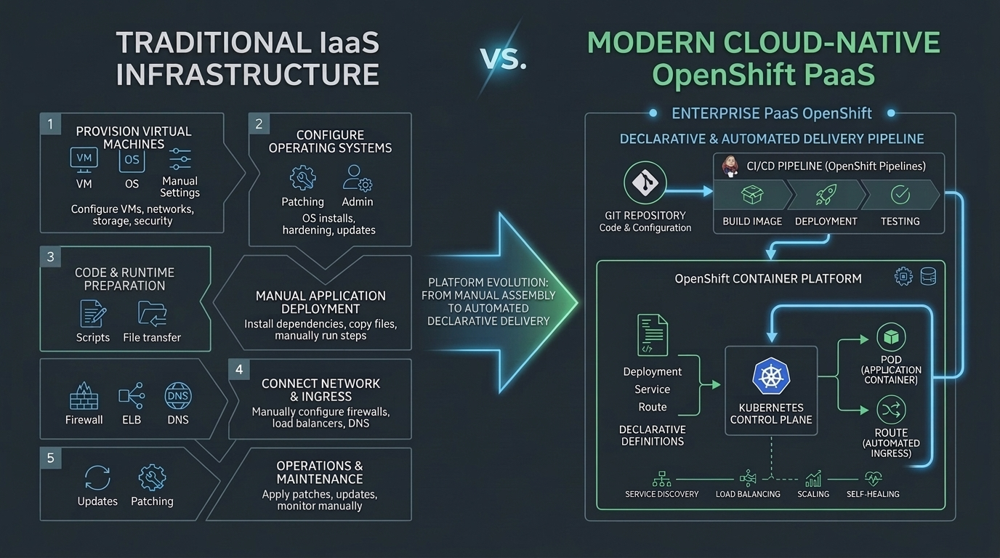

# Enterprise Multi-Tenant IaaS, Private Cloud & Platform Architecture Blueprint

[](https://www.fiap.com.br/mba/mba-em-multicloud-strategy-architect/)


> **Official reference architecture and hands-on laboratory suite developed for the [MBA em MultiCloud Strategy & Architecture](https://www.fiap.com.br/mba/mba-em-multicloud-strategy-architect/) at FIAP.**  
> *Covering Private Cloud Foundations (OpenStack / RHOSP CL110), Containerized Control Plane Engineering (Podman / Systemd), Multi-Tenant SDN Isolation, and the Enterprise Transition to Cloud-Native PaaS (Red Hat OpenShift & Kubernetes).*

---


---

## 🎯 Executive Overview & The Paradigm Shift

In modern infrastructure engineering, organizations face the **Cloud Economics & Data Sovereignty Paradox**: while public cloud hyperscalers offer rapid time-to-market, unconstrained egress fees, unpredictable operational expenditures (OpEx), and strict regulatory frameworks (LGPD, GDPR, Central Bank compliance) demand robust, self-hosted **Private & Hybrid Cloud** platforms. Conversely, traditional static virtualization (bare-metal clusters running legacy hypervisors) creates operational silos, manual provisioning bottlenecks, and high maintenance costs.

This repository establishes an end-to-end, enterprise-grade **Reference Architecture** designed to transition engineering teams from rigid virtualization to elastic, self-service **Infrastructure as a Service (IaaS)** and cloud-native **Platform as a Service (PaaS)**. By leveraging the **Red Hat OpenStack Platform (RHOSP)** alongside **Red Hat OpenShift (Kubernetes)**, this blueprint demonstrates how large enterprises build resilient, multi-tenant, and containerized private cloud ecosystems.

### The Four Architectural Pillars:

1. **Multi-Tenant Elastic IaaS & Resource Abstraction:** Decoupling physical server hardware from compute, network, and storage workloads via standardized OpenStack core daemons (Nova, Neutron, Cinder, Keystone, Glance).
2. **Stateless Containerized Control Plane:** Running OpenStack control plane microservices inside isolated, immutable **Podman** containers managed by Systemd (`conmon`), eliminating configuration drift and enabling zero-downtime rolling upgrades.
3. **Software-Defined Networking (SDN) & Distributed Security:** Enforcing complete tenant L2/L3 isolation, distributed virtual routing (DVR), Geneve/VXLAN overlay tunneling, and hypervisor-level stateful firewalling (*Security Groups*).
4. **The Strategic Bridge to Cloud-Native PaaS:** Establishing IaaS as the foundational substrate to run resilient, highly available container application platforms (**Red Hat OpenShift & Kubernetes**), transitioning developers from managing operating system instances to shipping declarative microservices.

---

## 🏗️ End-to-End Architectural Flow


### Lifecycle Architecture Matrix

| Stage | Architectural Phase | Domain Responsibility & Core Actions | Standards & Technology Stack | Production Guarantees & Deliverables |
| :---: | :--- | :--- | :--- | :--- |
| **0** | **Undercloud & Hardware Orchestration** | Bare-metal discovery, disk imaging, network configuration, and overcloud node provisioning. | OpenStack Ironic, TripleO Heat, PXE/IPMI | Automated bare-metal deployment of Controller and Compute nodes |
| **1** | **Containerized Control Plane** (Lab 02) | Exposing public/admin REST APIs, token lifecycle, database transactions, and RPC messaging. | Podman, Systemd, MariaDB Galera, RabbitMQ | High-availability clustered control plane with read-only puppet-generated configs |
| **2** | **Hypervisor & Virtualization Fabric** | CPU/RAM scheduling, kernel KVM virtualization, and instance runtime execution. | KVM, QEMU, Libvirt (`nova_libvirt`), Nova Compute | Hardware-accelerated VM execution with NUMA tuning and CPU pinning |
| **3** | **Software-Defined Network Fabric** (Lab 01) | Multi-tenant tenant networks, subnet routing, external floating IP NAT, and security groups. | Neutron, Open vSwitch (OVS), OVN, Geneve/VXLAN | L2/L3 multi-tenant isolation, stateful security group firewalling, and 1:1 NAT |
| **4** | **Site Reliability & Telemetry** (Lab 02) | Real-time container health monitoring, log stream aggregation, and cluster operational audits. | `conmon`, `journald`, Podman health checks | Live telemetry, container process supervisory logs, and MTTR reduction |
| **5** | **Cloud-Native PaaS Evolution** (Labs 03+) | Deploying containerized enterprise applications, S2I pipelines, autoscale policies, and GitOps. | Red Hat OpenShift, Kubernetes Operators, CRI-O | Declarative application delivery, self-healing deployments, and auto-scaling |

---

## 🧪 Modular Hands-on Lab Suite

The repository is structured into self-contained, progressive laboratory modules designed for enterprise practitioners. Each module solves a concrete infrastructure engineering challenge:

| Module | Guides / Roteiros | Enterprise Pain Point | Technical Solution & Modern Stack | Technical Tags | Key Deliverable & Artifact |
| :--- | :--- | :--- | :--- | :--- | :--- |
| [`lab01-openstack-iaas`](./lab01-openstack-iaas) | [🇧🇷 PT-BR](./lab01-openstack-iaas/Lab%2001%20-%20Roteiro%20Aluno.md) \| [🇺🇸 EN](./lab01-openstack-iaas/Lab%2001%20-%20Student%20Guide.md) | Slow, manual VM provisioning tickets causing developer friction and shadow IT | Self-service IaaS instance lifecycle via OpenStack CLI & Horizon web console | `iaas`, `openstack-cli`, `keystone`, `nova`, `neutron`, `horizon` | Active cloud instance (`finance-server1`), custom tenant network, and serial console telemetry |
| [`lab02-openstack-controller`](./lab02-openstack-controller) | [🇧🇷 PT-BR](./lab02-openstack-controller/Lab%2002%20-%20Roteiro%20Aluno.md) \| [🇺🇸 EN](./lab02-openstack-controller/Lab%2002%20-%20Student%20Guide.md) | Opaque monolith control planes that are difficult to troubleshoot, patch, and monitor | In-depth auditing of containerized daemons in Podman, Systemd conmon, and API logs | `rhosp`, `podman`, `systemd`, `conmon`, `microservices`, `sre` | Live daemon audit report, container log analysis, and Control Plane vs Data Plane separation proof |
| [`lab03-openshift-deploy`](./lab03-openshift-deploy) | [🇧🇷 PT-BR](./lab03-openshift-deploy/Lab%2003%20-%20Roteiro%20Aluno.md) \| [🇺🇸 EN](./lab03-openshift-deploy/Lab%2003%20-%20Student%20Guide.md) | Inconsistent manual app deployments, host port collisions, and lack of visual governance | Declarative microservice delivery on Red Hat OpenShift via `oc new-app` and Developer Topology view | `ocp4`, `openshift-cli`, `kubernetes`, `declarative-deploy`, `scc`, `topology-view` | Containerized web service deployed, monitored via Topology ring, and verified through CLI introspection |
| [`lab04-openshift-resilience`](./lab04-openshift-resilience) | [🇧🇷 PT-BR](./lab04-openshift-resilience/Lab%2004%20-%20Roteiro%20Aluno.md) \| [🇺🇸 EN](./lab04-openshift-resilience/Lab%2004%20-%20Student%20Guide.md) | Service downtime from process crashes, lack of automated L7 routing, and rigid capacity limits | Ingress routing via OpenShift Routes (HAProxy), automated Pod Self-Healing, and elastic replica scaling | `openshift-routes`, `ingress-l7`, `clusterip`, `self-healing`, `horizontal-scaling`, `resilience` | Public corporate FQDN route, proof of zero-downtime Pod chaos recovery, and 3-replica scaled application |
| [`lab05-openshift-probes`](./lab05-openshift-probes) | [🇧🇷 PT-BR](./lab05-openshift-probes/Lab%2005%20-%20Roteiro%20Aluno.md) \| [🇺🇸 EN](./lab05-openshift-probes/Lab%2005%20-%20Student%20Guide.md) | Undetected container deadlocks, broken L7 routing, plaintext credentials, and pod filesystem ephemerality | 12-factor env vars, Kubernetes Secrets (Base64), autonomous Liveness/Readiness Probes, and 1Gi PVC storage attachment | `ocp4`, `health-checks`, `liveness-probe`, `readiness-probe`, `secrets`, `pvc`, `storage` | Auto-healing deployment with configured probes, isolated secret injection, and persistent volume mount |
| [`lab06-openshift-s2i`](./lab06-openshift-s2i) | [🇧🇷 PT-BR](./lab06-openshift-s2i/Lab%2006%20-%20Roteiro%20Aluno.md) \| [🇺🇸 EN](./lab06-openshift-s2i/Lab%2006%20-%20Student%20Guide.md) | External Git dependency friction, image build overhead without Dockerfiles, and rigid SCC root restrictions | Air-gapped Rootless Gitea on port 3000, OpenShift Source-to-Image (S2I) pipelines, BuildConfigs, and ImageStreams | `s2i`, `gitea`, `rootless`, `buildconfig`, `imagestream`, `ci-cd`, `webhooks` | Self-hosted private Git server, automated S2I build stream, and zero-downtime application continuous rollout |
| [`lab07-openshift-capstone`](./lab07-openshift-capstone) | [🇧🇷 PT-BR](./lab07-openshift-capstone/Lab%2007%20-%20Roteiro%20Aluno.md) \| [🇺🇸 EN](./lab07-openshift-capstone/Lab%2007%20-%20Student%20Guide.md) | Fragmented architectures, state loss during database crashes, and lack of end-to-end multi-tier integration | Full-stack cloud-native deployment: S2I Node.js frontend, persistent MySQL backend, internal DNS discovery, and chaos audit | `capstone`, `multi-tier`, `mysql`, `dns-discovery`, `s2i`, `chaos-engineering`, `resilience` | Resilient Guestbook & Example Health multi-tier platform surviving database pod destruction with zero transactional data loss |

---

## 🌉 The Strategic Springboard: From IaaS to Cloud-Native PaaS



Modern infrastructure architects do not treat OpenStack and OpenShift as competing technologies; rather, they form a **symbiotic infrastructure continuum**:

* **OpenStack (IaaS):** Owns the physical data center, virtualization hardware, storage arrays (Ceph/SAN), and top-of-rack SDN fabrics. It delivers programmatic virtual compute instances, networks, and raw block storage on demand.
* **OpenShift (PaaS / Kubernetes):** Consumes OpenStack IaaS resources (via OpenStack Cloud Provider and Cinder CSI drivers) to run enterprise Kubernetes clusters. It frees developers from patching guest operating systems, configuring network interfaces, or managing kernel versions.

---

## 🚀 Quickstart Guide (Red Hat Academy Environment)


### Prerequisites & Access:
All hands-on labs are executed on the **Red Hat Academy (CL110 / DO180)** remote lab environment:

1. **Access the Portal:** Log in to the [Red Hat Academy Portal](https://rol.redhat.com/) using your student credentials.
2. **Start Cluster in Background (Cold Boot Mitigation):**
   * Upon entering the course dashboard, click **Start** on the lab environment.
   * *Architectural Note:* The CL110 environment provisions nested virtualization hypervisors (`controller0`, `compute0`, `director`, `workstation`). Booting this multi-node cluster takes approximately **15 to 20 minutes**. Initiate the boot during lecture onboarding to eliminate idle downtime.
3. **Connect to the Management Workstation:**
   * Open the remote web console or establish an SSH session to `workstation.lab.example.com` as user `student` (password: `student`).

### CLI Authentication & Tenant Switching:
Unlike public clouds with static API keys, OpenStack utilizes project-scoped environment variable files (`*rc`) authenticated against Keystone:

```bash
# Authenticate as Finance Project Developer
source ~/developer1-finance-rc

# Validate connection to the Overcloud API
openstack endpoint list
openstack token issue
```

### Accessing the Web Dashboard (Horizon):
* **URL:** `http://dashboard.overcloud.example.com`
* **Domain:** `Example`
* **Username:** `developer1`
* **Password:** `redhat`

---

## ⚙️ Key Architectural Patterns & Production Hardening

This reference implementation incorporates critical engineering lessons learned in enterprise telecommunications and banking cloud deployments:

* **Control Plane vs. Data Plane Failure Isolation:**
  The OpenStack control plane (`controller0`) manages state, API requests, and database records. If the controller experiences a network outage, hardware reboot, or maintenance cycle, **all running instances on compute hypervisors (`compute0`) continue executing and routing traffic uninterrupted**. The Data Plane operates locally in the Linux kernel and Open vSwitch flow tables.
* **Stateless Containerized Control Plane (Podman & Systemd):**
  OpenStack services run inside Podman containers monitored by `/usr/bin/conmon`. All configuration files (`/etc/nova/nova.conf`, `/etc/neutron/neutron.conf`) are mounted as **Read-Only (`ro`)** bind mounts from `/var/lib/config-data/puppet-generated/`. This guarantees strict immutability: operators cannot induce configuration drift, and container restarts always boot from verified, version-controlled templates.
* **Userland vs. Kernel Virtualization Boundaries:**
  In containerized hypervisors, management utilities such as `virsh` reside inside the `nova_libvirt` container (`sudo podman exec nova_libvirt virsh list --all`). The host OS remains minimal, while the actual virtual machine isolation is enforced directly by the Linux kernel's KVM (`/dev/kvm`) and QEMU hardware acceleration.
* **Software-Defined Networking & Distributed Security Groups:**
  Tenant networks operate on encapsulated overlay fabrics (Geneve/VXLAN). Security Groups are implemented as stateful connection-tracking firewalls right at the virtual network interface (vNIC) layer on the hypervisor. Associating a public Floating IP performs 1:1 bidirectional NAT (SNAT/DNAT) within the router's virtual network namespace.

---

## 🎓 Academic Validation & Field Hardening

This blueprint and interactive lab suite were architected, curated, and field-tested by **Rafael Matsuyama** for the **Cloud Builders / Cloud Computing & Infrastructure** curriculum in the **Executive MBA at FIAP** (São Paulo, Brazil).

Senior cloud engineers, DevOps practitioners, and enterprise architects across multiple cohorts have validated these scripts, scenarios, and verification steps against real-world production constraints.

---

## 🏷️ Release Cadence & Versioning Policy

This repository adheres to **Calendar Versioning with Cycle and Patch semantics (CalVer)** (`vYYYY.CYCLE.PATCH`) to balance enterprise infrastructure stability with annual academic curriculum updates:

```
  v2026 . 1 . 0
    │     │   │
    │     │   └── PATCH: Hotfixes, typo corrections & dependency bumps
    │     └────── CYCLE: Major semester updates, new lab modules, or upstream upgrades
    └──────────── YEAR:  Annual MBA curriculum baseline edition
```

* **Deterministic Reproducibility:** Each tagged release provides an immutable snapshot where all lab guides, CLI commands, and configurations are guaranteed to execute deterministically without runtime drift.
* **Cohort Pinning:** Tagged releases provide immutable curriculum snapshots for cohorts:
  ```bash
  git checkout tags/vYYYY.CYCLE.PATCH
  ```
* Formal releases and changelogs are published on the official [GitHub Releases](https://github.com/rafaelmatsuyama/FIAP-CLD-CloudBuilders/releases) page.

---

## 👨‍💻 Author & Leadership

**Rafael Matsuyama**  
*Professor & Cloud Solutions Architect*  
*Specialist in Enterprise Cloud Architecture, Kubernetes, Distributed Systems, and Data Platforms.*

* 🌐 **LinkedIn:** [linkedin.com/in/rafaelmatsuyama](https://www.linkedin.com/in/rafaelmatsuyama/)
* 🐙 **GitHub:** [github.com/rafaelmatsuyama](https://github.com/rafaelmatsuyama)
* 🏫 **Institution:** [FIAP — MBA em MultiCloud Strategy & Architecture](https://www.fiap.com.br/mba/mba-em-multicloud-strategy-architect/)

---

## 📄 License & Intellectual Property

This repository employs a dual-licensing model (see full terms in [`LICENSE`](./LICENSE)):

* **Code, Scripts & Configurations:** Licensed under the **[Apache License 2.0](https://www.apache.org/licenses/LICENSE-2.0)**.
* **Educational Materials & Courseware:** Licensed under the **[Creative Commons Attribution-NonCommercial-ShareAlike 4.0 International (CC BY-NC-SA 4.0)](https://creativecommons.org/licenses/by-nc-sa/4.0/)**.
